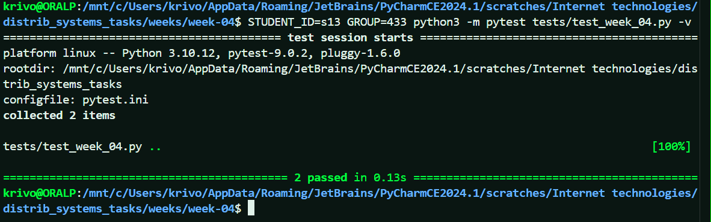

# Saga для проекта logs-s13

## Шаги бизнес-процесса (оркестрация)
1. **Создать запись лога** (статус `NEW`).
2. **Сохранить лог в хранилище** (аналог «резервирования»).  
   - Успех → статус `PAID`.
   - Ошибка → запускается компенсация: удалить созданную запись, статус `CANCELLED`.
3. **Индексировать лог для поиска** (финальный шаг).  
   - Успех → статус `DONE`.
   - Ошибка → компенсация: удалить лог из хранилища, затем удалить запись, статус `CANCELLED`.

## Статусы заказа (лога)
- `NEW` – создана запись.
- `PAID` – лог сохранён в хранилище.
- `DONE` – лог проиндексирован, процесс завершён.
- `CANCELLED` – процесс прерван, все изменения отменены.

## Компенсирующие транзакции
- **Отмена сохранения** (если упала индексация): удалить лог из хранилища.
- **Отмена создания записи** (если упало сохранение или индексация): удалить запись лога из БД.
- **Retry**: при сбое компенсирующей операции (например, не удалось удалить из хранилища) повторять попытки с экспоненциальной задержкой до успеха.

# Saga для проекта logs-s13

## Шаги бизнес-процесса (оркестрация)
1. **Создать запись лога** (статус `NEW`).
2. **Сохранить лог в хранилище** (аналог «резервирования»).  
   - Успех → статус `PAID`.
   - Ошибка → запускается компенсация: удалить созданную запись, статус `CANCELLED`.
3. **Индексировать лог для поиска** (финальный шаг).  
   - Успех → статус `DONE`.
   - Ошибка → компенсация: удалить лог из хранилища, затем удалить запись, статус `CANCELLED`.

## Статусы заказа (лога)
- `NEW` – создана запись.
- `PAID` – лог сохранён в хранилище.
- `DONE` – лог проиндексирован, процесс завершён.
- `CANCELLED` – процесс прерван, все изменения отменены.

## Компенсирующие транзакции
- **Отмена сохранения** (если упала индексация): удалить лог из хранилища.
- **Отмена создания записи** (если упало сохранение или индексация): удалить запись лога из БД.
- **Retry**: при сбое компенсирующей операции (например, не удалось удалить из хранилища) повторять попытки с экспоненциальной задержкой до успеха.

## Диаграмма переходов состояний
PAY_OK
NEW ----------------> PAID
|
| PAY_FAIL
v
CANCELLED

PAID ----------------> DONE (INDEX_OK)
| ^
| INDEX_FAIL |
|-->(компенсация)------|
| (удалить из хранилища)
v
CANCELLED

PAID ----------------> CANCELLED (CANCEL по запросу пользователя)
project_code: logs-s13

